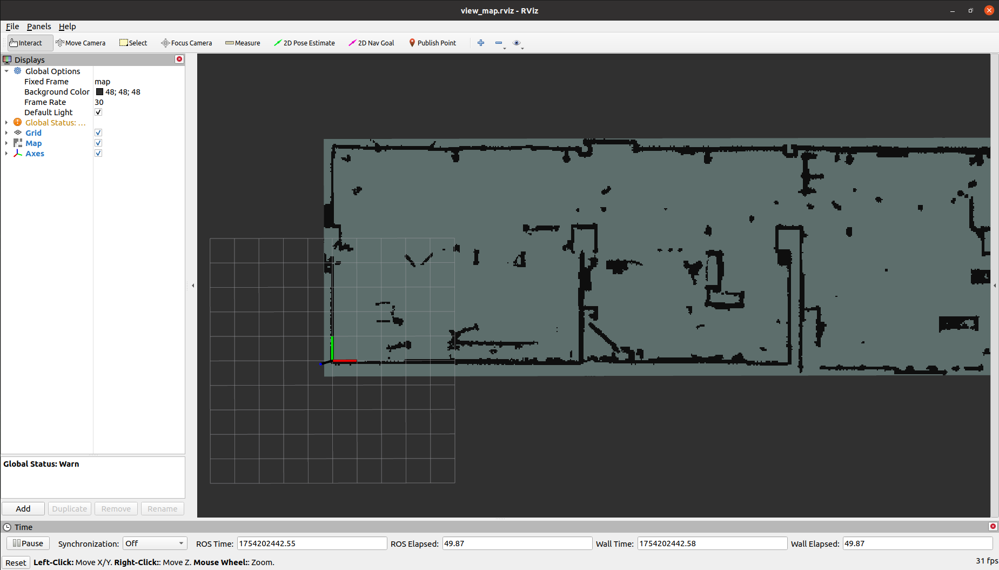

# Mixed Nav

这个包是一个混合导航demo，将3D点云文件抽取指定高度映射成 2D 地图文件，并用到了 RealSense D435i、Spatio Temporal Voxel Layer、move_base 等插件，并提供了仿真和真机两种启动方式。目的是和我的另一个开源项目结合使用，实现用 Mid360 + Fast-Lio 魔改版的建图、定位、导航。

代码中涉及到的开源仓库如下所示：

* RealSense-ROS：[https://github.com/IntelRealSense/realsense-ros](https://github.com/IntelRealSense/realsense-ros)
* Spatio-Temporal Voxel Layer：[https://github.com/SteveMacenski/spatio_temporal_voxel_layer](https://github.com/SteveMacenski/spatio_temporal_voxel_layer)

代码在以下环境中通过了测试，更多的平台测试将持续推出：

|Device|Plantform|OS|ROS|
|--|--|--|--|
|Nvidia Orin DK|Arm|Ubuntu 20.04|Noetic|

这个工程中涉及到的部分资源可以在下面的网盘链接中找到：

```txt
https://pan.baidu.com/s/1N1MpEK--n21-cuk45Z0BBA?pwd=sf9y
```

----
# Step1. 安装依赖

## 基础依赖库
在你的环境中需要安装不限于以下几个依赖：

```bash
$ sudo apt-get install ros-noetic-navigation ros-noetic-tf2-sensor-msgs libopenvdb-dev
```

## conda 环境
因为将点云文件转化为 2D 栅格地图需要一些 python 的库，建议在新建一个 conda 环境进行操作以避免影响到本机环境。

```bash
$ conda create -n mapconv python=3.10
$ conda activate mapconv
$ pip install numpy open3d PyYAML Pillow
```

---
# Step2. 拉取源码并编译

在安装完依赖库后使用下面的命令编译源码，假设你的工作空间名字是 `nav_ws`：

```bash
$ cd nav_ws/src
$ git clone --recursive git@github.com:GaohaoZhou-ops/Mixed-Navigation.git
```

使用下面的命令编译源码：

```bash
$ cd nav_ws
$ catkin_make
```

----
# Step3. 获取地图点云文件

## 使用示例地图文件

如果你暂时还没有完成建图，可以从上面的网盘链接中下载名为 `room_zheng.ply` 的点云地图文件并将其移动到 `mixed_nav/resources` 位置：


此时你的工程目录结构应该如下所示：

```bash
$ cd nav_ws
$ tree -L 2

└── src
    ├── CMakeLists.txt -> /opt/ros/noetic/share/catkin/cmake/toplevel.cmake
    ├── mixed_nav
    ├── ReadMe.md
    ├── realsense-ros
    └── spatio_temporal_voxel_layer

```

其中 `mixed_nav` 包中的结构如下所示：

```bash
$ cd src/mixed_nav
$ tree 
.
├── CMakeLists.txt
├── config
│   ├── costmap_common_params.yaml
│   ├── dwa_local_planner_params.yaml
│   ├── global_costmap_params.yaml
│   └── local_costmap_params.yaml
├── include
│   └── mixed_nav
├── launch
│   ├── navigation_sim.launch
│   └── view_map.launch
├── package.xml
├── resources
│   ├── 2d_room_zheng.pgm
│   ├── 2d_room_zheng.yaml
│   ├── images
│   └── room_zheng.ply      # 下载好的点云地图
├── rviz
│   ├── nav_rviz.rviz
│   └── view_map.rviz
├── scripts
│   ├── pc2pgm.py
│   └── simulation.py
└── src
```

## 使用自己现成的地图文件

如果你已经有了一份点云地图文件，将其移动到 `src/mixed_nav/resources` 目录中即可。

## 使用 Fast-Lio 进行建图

可以参考我另外一个仓库用 Fast-Lio 进行建图，完成建图后将点云文件移动到 `src/mixed_nav/resources` 目录中即可。

【待补充】

---
# Step4. 转换点云地图文件

进入到 `nav_ws/src/mixed_nav` 目录下并激活 conda 环境：

```bash
$ cd nav_ws/src/mixed_nav
$ conda activate mapconv
```

然后使用脚本 `scripts/pc2pgm.py` 并结合可选参数将点云地图文件转换成 2D 栅格地图，假设你的地图名为 `room_zheng.ply`，下面命令执行后会将点云文件中高度在 $[0.1,0.8]$ 范围内的点云压缩成一个 2D 地图，并保存到 `resources` 文件夹下：

```bash
$ python scripts/pc2pgm.py resources/room_zheng.ply --min_z 0.1 --max_z 0.8
```

成功运行的输入示例如下：
```bash
未指定 --map_name，使用默认名称: 2d_room_zheng
正在加载点云文件: resources/room_zheng.ply...
点云加载成功，包含 17734527 个点。
正在根据高度范围过滤点云 (min_z: -0.7 m, max_z: 0.2 m)...
过滤后剩余 3463479 个点。
计算出的地图尺寸: 634 x 194 像素。
正在保存PGM地图文件到: resources/2d_room_zheng.pgm
/home/orin/Desktop/nav_ws/src/mixed_nav/scripts/pc2pgm.py:70: DeprecationWarning: 'mode' parameter is deprecated and will be removed in Pillow 13 (2026-10-15)
  img = Image.fromarray(map_data, mode='L')
正在保存YAML配置文件到: resources/2d_room_zheng.yaml

处理完成！
地图文件: resources/2d_room_zheng.pgm
配置文件: resources/2d_room_zheng.yaml

您现在可以使用ROS map_server加载此地图:
rosrun map_server map_server /home/orin/Desktop/nav_ws/src/mixed_nav/resources/2d_room_zheng.yaml
```

该脚本提供了其他几个可选参数，使用 `--help` 查看具体功能。

【可选】使用下面的命令查看一下生成的点云地图是否满足你的需求，如果不满足可以通过修改 $Z$ 轴的高度范围重新生成：

```bash
$ cd nav_ws
$ source devel/setup.bash 
$ roslaunch mixed_nav view_map.launch
```



----
# Step5. 启动仿真导航

使用下面的命令启动仿真导航：

```bash
$ cd nav_ws
$ source devel/setup.bash 
$ roslaunch mixed_nav navigation_sim.launch
```

如果你已经安装好 RealSense SDK 那么可以顺便启动相机，这样能够将点云映射到局部代价地图上以实现更动态的导航避障，如果你目前没有连接相机也不会影响仿真：

```bash
$ cd nav_ws
$ source devel/setup.bash 
$ roslaunch realsense2_camera rs_rgbd.launch 
```


在仿真 rviz 界面中使用 `2D Pose Estimate` 按钮给一个初试姿态如下图所示：


再提供一个 `2D Nav Goal` 可以模拟导航目的地：


---
# Step6. 使用真机导航

【未完待续】