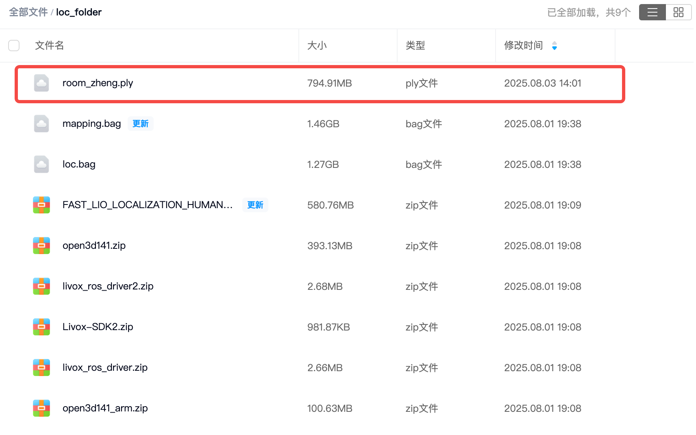
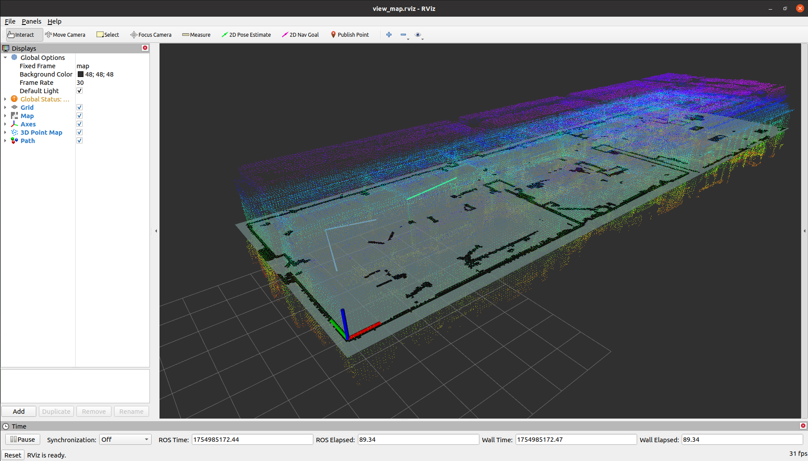
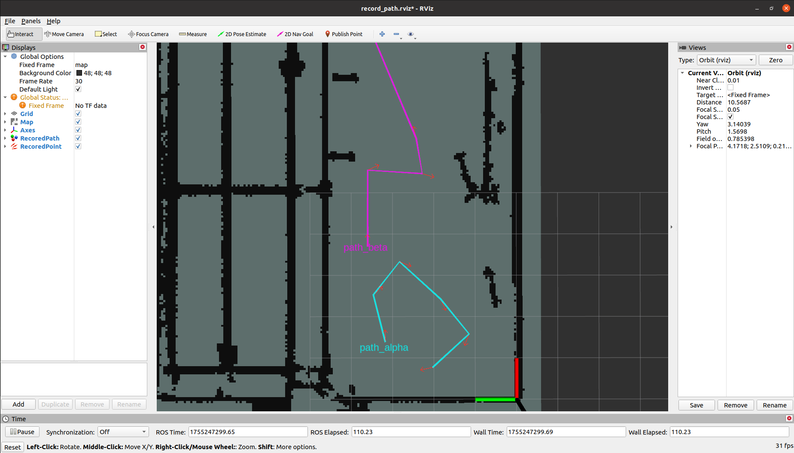
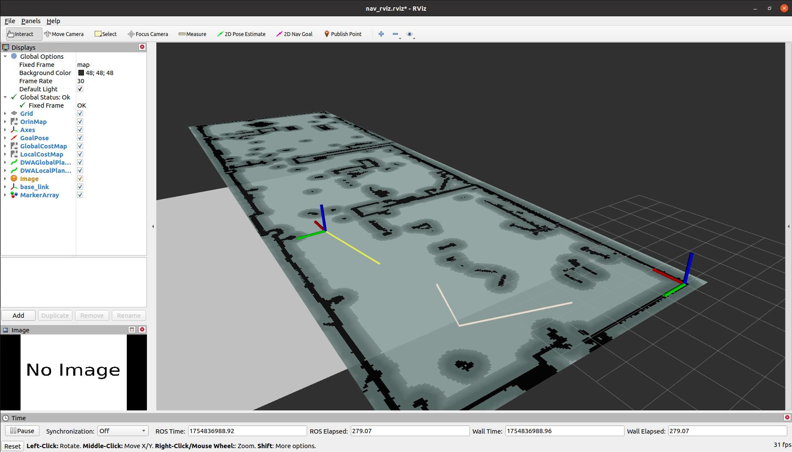
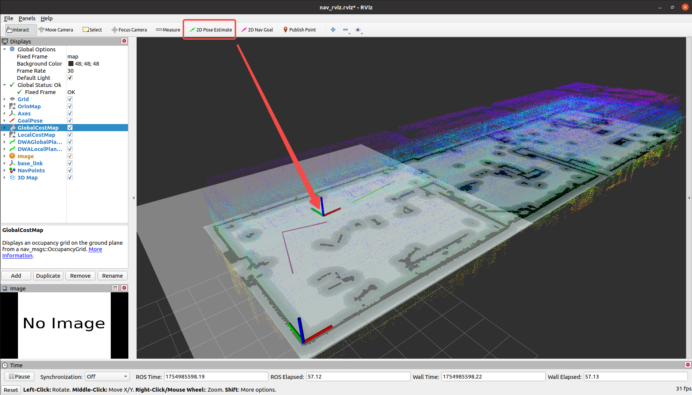
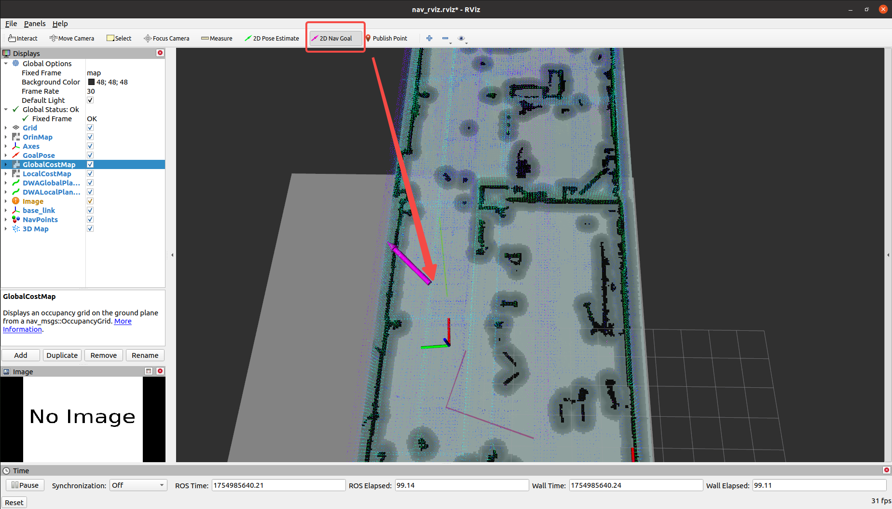
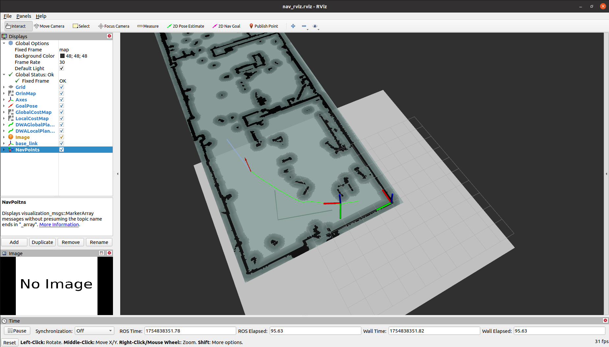
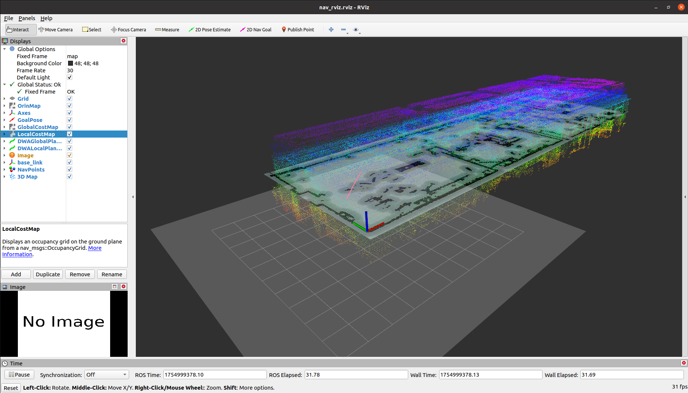
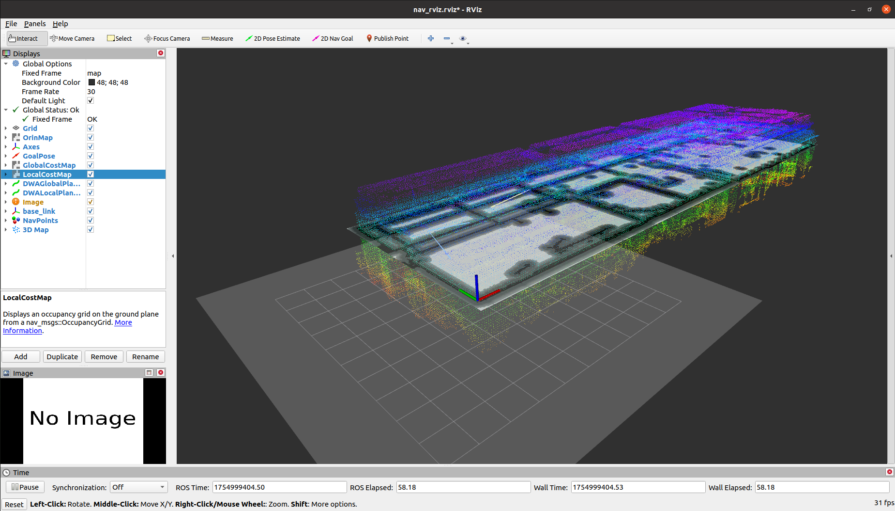
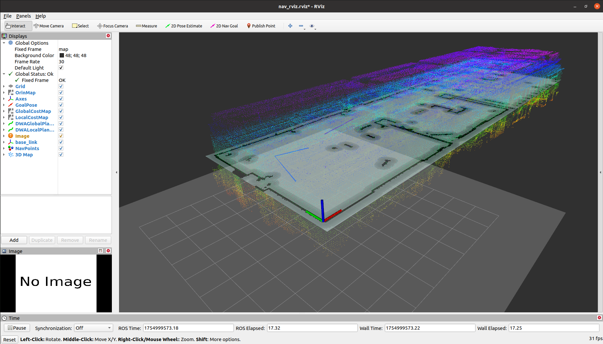

# Mixed Nav

这个包是一个混合导航demo，将3D点云文件抽取指定高度映射成 2D 地图文件，并用到了 RealSense D435i、Spatio Temporal Voxel Layer、move_base 等插件，并提供了仿真和真机两种启动方式。目的是和我的另一个开源项目结合使用，实现用 Mid360 + Fast-Lio 魔改版的建图、定位、导航。

代码中涉及到的开源仓库如下所示：

* RealSense-ROS：[https://github.com/IntelRealSense/realsense-ros](https://github.com/IntelRealSense/realsense-ros)
* Spatio-Temporal Voxel Layer：[https://github.com/SteveMacenski/spatio_temporal_voxel_layer](https://github.com/SteveMacenski/spatio_temporal_voxel_layer)

代码在以下环境中通过了测试，更多的平台测试将持续推出：

|Device|Plantform|OS|ROS|
|--|--|--|--|
|Nvidia Orin DK|Arm|Ubuntu 20.04|Noetic|

这个工程中涉及到的部分资源可以在下面的网盘链接中找到：

```txt
https://pan.baidu.com/s/1N1MpEK--n21-cuk45Z0BBA?pwd=sf9y
```

----
# Step1. 安装依赖

## 基础依赖库
在你的环境中需要安装不限于以下几个依赖：

```bash
$ sudo apt-get install ros-noetic-navigation ros-noetic-tf2-sensor-msgs libopenvdb-dev
$ sudo apt-get install libopenvdb-dev
$ sudo apt-get install ros-noetic-teb-local-planner
```

## conda 环境
因为将点云文件转化为 2D 栅格地图需要一些 python 的库，建议在新建一个 conda 环境进行操作以避免影响到本机环境。

```bash
$ conda create -n mapconv python=3.10
$ conda activate mapconv
$ pip install "numpy<2.0"
$ pip install cython open3d PyYAML Pillow commentjson pyntcloud rospkg
```

---
# Step2. 源码编译
## 拉取源码
在安装完依赖库后使用下面的命令编译源码，假设你的工作空间名字是 `nav_ws`：

```bash
$ cd nav_ws/src
$ git clone https://github.com/GaohaoZhou-ops/Mixed-Navigation.git
```

因为这里没有对另外两个包中的源码进行修改，所以在拉取后还需要切换一下分支：

```bash
$ cd nav_ws/src/
$ git clone https://github.com/IntelRealSense/realsense-ros.git
$ cd realsense-ros
$ git checkout ros1-legacy

$ cd nav_ws/src/
$ git clone https://github.com/SteveMacenski/spatio_temporal_voxel_layer.git
$ cd spatio_temporal_voxel_layer
$ git checkout noetic-devel
```

## 修改 realsense-ros 源码
需要对 `realsense-ros/realsense2_camera/CMakeLists.txt` 文件进行修改，主要是添加 OpenCV 相关的部分：

```cmake
find_package(OpenCV REQUIRED)     # 添加 OpenCV 库
find_package(catkin REQUIRED COMPONENTS
    message_generation
    nav_msgs
    roscpp
    sensor_msgs
    std_msgs
    std_srvs
    nodelet
    cv_bridge
    image_transport
    tf
    ddynamic_reconfigure
    diagnostic_updater
    OpenCV REQUIRED               # 添加 OpenCV 库
    )

...

include_directories(
    include
    ${realsense2_INCLUDE_DIR}
    ${catkin_INCLUDE_DIRS}
    ${OpenCV_INCLUDE_DIRS}        # 添加 OpenCV 头文件目录
    )

...

target_link_libraries(${PROJECT_NAME}
    ${realsense2_LIBRARY}
    ${catkin_LIBRARIES}
    ${CMAKE_THREAD_LIBS_INIT}
    ${OpenCV_LIBRARIES}           # 添加 OpenCV 库文件目录
    )

```

然后使用下面的命令编译源码：

```bash
$ cd nav_ws
$ catkin_make
```

----
# Step3. 获取地图点云文件

## 使用示例地图文件

如果你暂时还没有完成建图，可以从上面的网盘链接中下载名为 `room_zheng.ply` 的点云地图文件并将其移动到 `mixed_nav/resources` 位置：



此时你的工程目录结构应该如下所示：

```bash
$ cd nav_ws
$ tree -L 2

└── src
    ├── CMakeLists.txt -> /opt/ros/noetic/share/catkin/cmake/toplevel.cmake
    ├── mixed_nav
    ├── ReadMe.md
    ├── realsense-ros
    └── spatio_temporal_voxel_layer

```

其中 `mixed_nav/resources/floors` 包中的结构如下所示：

```bash
$ cd src/mixed_nav/resources/floors
.
├── floor0
│   ├── floor0.pgm
│   ├── floor0.yaml
│   └── waypoints.json
├── floor1
│   ├── floor1.pgm
│   ├── floor1.yaml
│   └── waypoints.json
├── floor3
│   ├── floor3.pgm
│   ├── floor3.yaml
│   └── waypoints.json
├── room_zheng.ply      # 下载好的点云地图文件
└── z_config.json

```

## 使用自己现成的地图文件

如果你已经有了一份点云地图文件，将其移动到 `src/mixed_nav/resources` 目录中即可。

## 使用 Fast-Lio 进行建图

可以参考我另外一个仓库用 Fast-Lio 进行建图，完成建图后将点云文件移动到 `src/mixed_nav/resources` 目录中即可。

【待补充】

---
# Step4. 转换点云地图文件

进入到 `nav_ws/src/mixed_nav` 目录下并激活 conda 环境：

```bash
$ cd nav_ws/src/mixed_nav
$ conda activate mapconv
```

然后使用脚本 `scripts/tools/pc2pgm.py` 并结合可选参数将点云地图文件转换成 2D 栅格地图，假设你的地图名为 `room_zheng.ply`，下面命令执行后会将点云文件中高度在 $[0.1,0.8]$ 范围内的点云压缩成一个 2D 地图，并保存到 `resources/floors` 文件夹下：

```bash
$ python scripts/pc2pgm.py resources/room_zheng.ply  --floor_name floor0 --min_z 0.1 --max_z 0.8
```

成功运行的输入示例如下：
```bash
未指定 --map_name，使用默认名称: 2d_room_zheng
正在加载点云文件: resources/room_zheng.ply...
点云加载成功，包含 17734527 个点。
正在根据高度范围过滤点云 (min_z: -0.7 m, max_z: 0.2 m)...
过滤后剩余 3463479 个点。
计算出的地图尺寸: 634 x 194 像素。
正在保存PGM地图文件到: resources/2d_room_zheng.pgm
/home/orin/Desktop/nav_ws/src/mixed_nav/scripts/pc2pgm.py:70: DeprecationWarning: 'mode' parameter is deprecated and will be removed in Pillow 13 (2026-10-15)
  img = Image.fromarray(map_data, mode='L')
正在保存YAML配置文件到: resources/2d_room_zheng.yaml

处理完成！
地图文件: resources/2d_room_zheng.pgm
配置文件: resources/2d_room_zheng.yaml

您现在可以使用ROS map_server加载此地图:
rosrun map_server map_server /home/orin/Desktop/nav_ws/src/mixed_nav/resources/2d_room_zheng.yaml
```

该脚本提供了其他几个可选参数，使用 `--help` 查看具体功能。

【可选】使用下面的命令查看一下生成的点云地图是否满足你的需求，如果不满足可以通过修改 $Z$ 轴的高度范围重新生成：

下面的命令会同时加载一份 3D 点云地图，由于点云文件通常比较大，因此可能会消耗一定时间，如果你不想加载点云文件可以修改 `map_server.launch` 文件中的参数配置取消显示：

```bash
$ cd nav_ws
$ source devel/setup.bash 
$ roslaunch mixed_nav map_server.launch
```




---
# Step5. 设置导航点

在完成地图编辑后使用下面的命令启动导航点记录节点，你需要在 `src/Mixed-Navigation/mixed_nav/launch/record_nav_points.launch` 文件中明确指出当前地图所在的楼层 `floor_name` 以让 map_server 加载地图信息：
 
```bash
$ cd nav_ws
$ source devel/setup.bash 
$ roslaunch mixed_nav record_nav_points.launch
```

记录节点每次启动后可以录制多条导航轨迹，新开一个终端并调用服务 `/start_record_nav_point` 来告知节点当前路径名，这里假设为 `path_alpha`

```bash
$ cd nav_ws
$ source devel/setup.bash 
$ rosservice call /start_record_nav_point "path_name: 'path_alpha'" 
```

然后在 rviz 窗口中使用 `2D Nav Goal` 按钮按照顺序逐个创建导航点；如果你在录制过程中操作失误，可以调用服务 `/undo_record_nav_point` 取消最近一次记录。

当一条路径录制结束后调用服务 `/finish_record_nav_point` 告知当前结束录制。



最终得到的路径会保存到 `src/Mixed-Navigation/mixed_nav/resources/floors/floor_name/waypoints.json` 文件中：

```json
{
  "path_alpha": [
      {
          "position": {
              "x": 1.382780909538269,
              "y": 3.176682710647583,
              "z": 0.0
          },
          "orientation": {
              "x": 0.0,
              "y": 0.0,
              "z": 0.0114526433511636,
              "w": 0.9999344163295266
          }
      },
    ],
    // ...
    "path_beta": [
    {
        "position": {
            "x": 3.6949002742767334,
            "y": 3.6009724140167236,
            "z": 0.0
        },
        "orientation": {
            "x": 0.0,
            "y": 0.0,
            "z": 0.011048003717325597,
            "w": 0.9999389689445362
        }
    },
    ]
  }
```

----
# Step6. 启动仿真导航

如果你已经安装好 RealSense SDK 那么可以顺便启动相机，这样能够将点云映射到局部代价地图上以实现更动态的导航避障，如果你目前没有连接相机也不会影响仿真：

```bash
$ cd nav_ws
$ source devel/setup.bash 
$ roslaunch realsense2_camera rs_rgbd.launch 
```



在仿真 rviz 界面中使用 `2D Pose Estimate` 按钮给一个初试姿态如下图所示：



使用下面的命令启动仿真导航：

```bash
$ cd nav_ws
$ source devel/setup.bash 
$ roslaunch mixed_nav navigation_sim.launch
```

## 功能一：自由路径导航

在rviz中提供一个 `2D Nav Goal` 可以模拟自由导航到目的地：



## 功能二：逐点导航

该功能需要确保 `waypoints` 文件夹中的导航路径文件存在且内容无误，使用下面的命令朝 `/track_points/goal` 话题发布一个路径组名 `path_group_name` 以及死区半径 `dead_zone_radius` 可以让其自动沿着路径组 `path_beta` 进行逐点导航。本质是逐点发布导航点到 `/move_base_simple/goal` 话题中让 move_base 完成路径规划功能，期间实时监听 `base_link` 是否到达死区内，如果到达则发布下一个点

```bash
$ rostopic pub /track_points/goal mixed_nav/PathNavigationActionGoal "header:
  seq: 0
  stamp:
    secs: 0
    nsecs: 0
  frame_id: ''
goal_id:
  stamp:
    secs: 0
    nsecs: 0
  id: ''
goal:
  path_group_name: 'path_beta'
  dead_zone_radius: 0.2" 
```



---
# Step7. 切换地图

如果你想要使用不同高度或楼层作为导航地图，使用下面的命令可以进行地图切换，切换成功后对应的地图点云文件也会同步修改：

```bash
$ cd nav_ws
$ source devel/setup.bash
$ rosservice call /switch_floor "floor_name": 'floor0'
```

|floor0|floor1|floor3|
|--|--|---|
||||