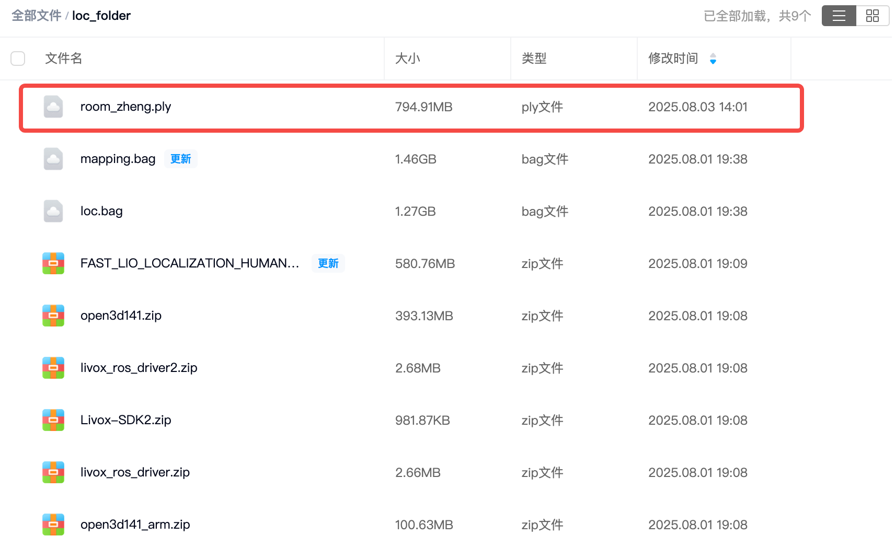
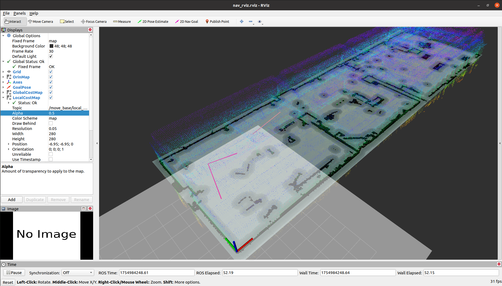
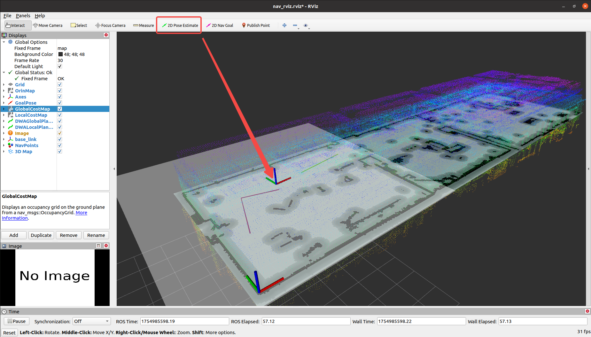
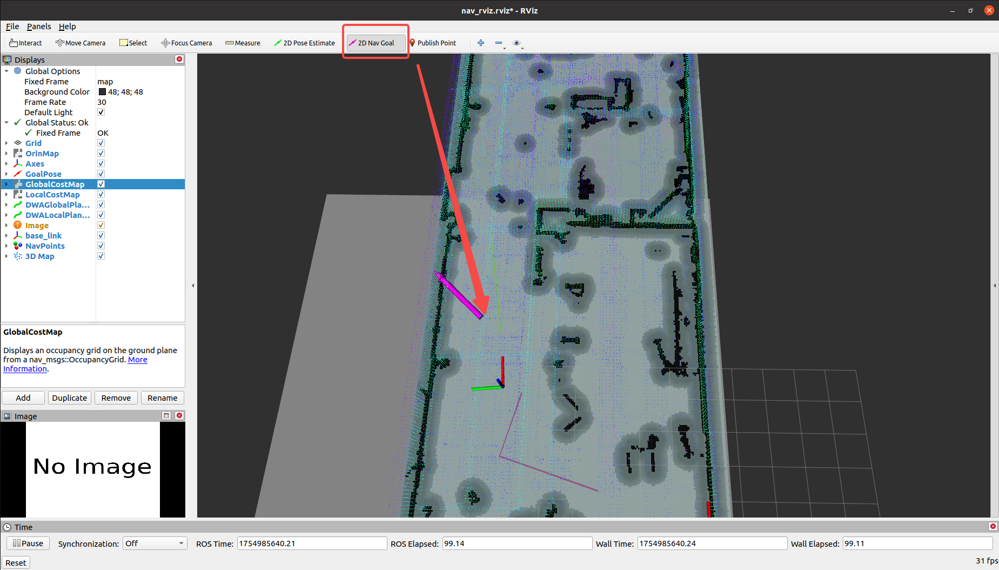

# Mixed Nav

This package is a hybrid navigation demo that extracts specified heights from a 3D point cloud file and maps it into a 2D map file. It utilizes plugins such as the RealSense D435i, Spatio Temporal Voxel Layer, and move_base, and provides both simulation and real-device startup options. It's intended to be used in conjunction with another open-source project of mine, enabling mapping, positioning, and navigation using a modified version of Mid360 + Fast-Lio.

The open source repositories referenced in this code are as follows:

* RealSense-ROS: [https://github.com/IntelRealSense/realsense-ros](https://github.com/IntelRealSense/realsense-ros)
* Spatio-Temporal Voxel Layer: [https://github.com/SteveMacenski/spatio_temporal_voxel_layer](https://github.com/SteveMacenski/spatio_temporal_voxel_layer)

This code has been tested on the following environments, and more platform tests will be released soon:

|Device|Plantform|OS|ROS|
|--|--|--|--|
|Nvidia Orin DK|Arm|Ubuntu 20.04|Noetic|

Some of the resources involved in this project can be found in the following network drive link:

```txt
https://pan.baidu.com/s/1N1MpEK--n21-cuk45Z0BBA?pwd=sf9y
```

----

# Step 1. Install Dependencies

## Basic Dependencies
In your environment, you need to install, but are not limited to, the following dependencies:

```bash
$ sudo apt-get install ros-noetic-navigation ros-noetic-tf2-sensor-msgs libopenvdb-dev
$ sudo apt-get install libopenvdb-dev
```

## Conda Environment
Because converting point cloud files to 2D raster maps requires some Python libraries, it is recommended to create a new conda environment to avoid affecting your local environment.

```bash
$ conda create -n mapconv python=3.10
$ conda activate mapconv
$ pip install "numpy<2.0"
$ pip install cython open3d PyYAML Pillow commentjson pyntcloud rospkg
```

---
# Step 2. Compile the Source Code
## Pull the Source Code
After installing the dependent libraries, compile the source code using the following command. Assuming your workspace is named `nav_ws`:

```bash
$ cd nav_ws/src
$ git clone https://github.com/GaohaoZhou-ops/Mixed-Navigation.git
```

Because the source code in the other two packages is not modified here, you will need to switch branches after pulling:

```bash
$ cd nav_ws/src/
$ git clone https://github.com/IntelRealSense/realsense-ros.git
$ cd realsense-ros
$ git checkout ros1-legacy

$ cd nav_ws/src/
$ git clone https://github.com/SteveMacenski/spatio_temporal_voxel_layer.git
$ cd spatio_temporal_voxel_layer
$ git checkout noetic-devel
```

## Modify the realsense-ros source code
You need to modify the `realsense-ros/realsense2_camera/CMakeLists.txt` file, mainly adding OpenCV-related sections:

```cmake
find_package(OpenCV REQUIRED) # Add the OpenCV library
find_package(catkin REQUIRED COMPONENTS
message_generation
nav_msgs
roscpp
sensor_msgs
std_msgs
std_srvs
nodelet
cv_bridge
image_transport
tf
ddynamic_reconfigure
diagnostic_updater
OpenCV REQUIRED # Add the OpenCV library
)

...

include_directories(
include
${realsense2_INCLUDE_DIR}
${catkin_INCLUDE_DIRS}
${OpenCV_INCLUDE_DIRS} # Add the OpenCV header file directory
)

...

target_link_libraries(${PROJECT_NAME}
${realsense2_LIBRARY}
${catkin_LIBRARIES}
${CMAKE_THREAD_LIBS_INIT}
${OpenCV_LIBRARIES} # Add the OpenCV library directory
)

```

Then compile the source code using the following command:

```bash
$ cd nav_ws
$ catkin_make
```

# Step 3. Obtain the map point cloud file

## Using the sample map file

If you haven't completed the map yet, you can download the point cloud map file named `room_zheng.ply` from the network disk link above and move it to `mixed_nav/resources`:



Your project directory structure should now look like this:

```bash
$ cd nav_ws
$ tree -L 2

└── src
├── CMakeLists.txt -> /opt/ros/noetic/share/catkin/cmake/toplevel.cmake
├── mixed_nav
├── ReadMe.md
├── realsense-ros
└── spatio_temporal_voxel_layer

```

Where `mixed_nav` The structure in the package looks like this:

```bash
$ cd src/mixed_nav
.
├── action
│ └── PathNavigation.action
├── CMakeLists.txt
├── config
│ ├── costmap_common_params.yaml
│ ├── dwa_local_planner_params.yaml
│ ├── global_costmap_params.yaml
│ └── local_costmap_params.yaml
├── include
├── launch
│ ├── map_server.launch
│ └── navigation_sim.launch
├── package.xml
├── resources
│ ├── 2d_room_zheng.pgm
│ ├── 2d_room_zheng.yaml
│ ├── room_zheng.ply # Download the point cloud file
│ └── images
├── rviz
│ ├── nav_rviz.rviz
│ ├── path_points.rviz
│ └── view_map.rviz
├── scripts
│ ├── path_navigator_node.py
│ ├── pc2pgm.py
│ ├── pcd_map_publisher.py
│ ├── simulation.py
│ └── visualize_nav_paths.py
└── waypoints
└── nav_points.json
```

## Using Your Own Existing Map File

If you already have a point cloud map file, simply move it to the `src/mixed_nav/resources` directory.

## Mapping with Fast-Lio

You can refer to my other repository for mapping with Fast-Lio. After completing the mapping, move the point cloud file to the `src/mixed_nav/resources` directory.

[To be added]

---
# Step 4. Convert the point cloud map file

Go to the `nav_ws/src/mixed_nav` directory and activate the conda environment:

```bash
$ cd nav_ws/src/mixed_nav
$ conda activate mapconv
```

Then use the `scripts/pc2pgm.py` script with optional parameters to convert the point cloud map file into a 2D raster map. Assuming your map is named `room_zheng.ply`, the following command will compress all points in the point cloud file with heights within the range $[0.1,0.8]$ into a 2D map and save it to the `resources` folder:

```bash
$ python scripts/pc2pgm.py resources/room_zheng.ply --min_z 0.1 --max_z 0.8
```

An example of a successful run is as follows:
```bash
Unspecified --map_name, using the default name: 2d_room_zheng
Loading point cloud file: resources/room_zheng.ply...
Point cloud loaded successfully, containing 17,734,527 points.
Filtering point cloud based on altitude range (min_z: -0.7 m, max_z: 0.2 m)...
3,463,479 points remaining after filtering.
Calculated map size: 634 x 194 pixels.
Saving PGM map file to: resources/2d_room_zheng.pgm
/home/orin/Desktop/nav_ws/src/mixed_nav/scripts/pc2pgm.py:70: DeprecationWarning: 'mode' parameter is deprecated and will be removed in Pillow 13 (2026-10-15)
img = Image.fromarray(map_data, mode='L')
Saving YAML configuration file to: resources/2d_room_zheng.yaml

Processing completed!
Map file: resources/2d_room_zheng.pgm
Configuration file: resources/2d_room_zheng.yaml

You can now load this map using the ROS map_server:
rosrun map_server map_server /home/orin/Desktop/nav_ws/src/mixed_nav/resources/2d_room_zheng.yaml

This script provides several optional parameters. Use `--help` to view their functionality.

[Optional] Use the following command to check whether the generated point cloud map meets your needs. If not, you can regenerate it by modifying the Z axis height range:

The following command will load a 3D point cloud map. Since point cloud files are typically large, this may take some time. If you do not want to load the point cloud file, you can modify the configuration parameters in the `map_server.launch` file to disable the display:

```bash
$ cd nav_ws
$ source devel/setup.bash
$ roslaunch mixed_nav map_server.launch
```


---
# Step 5. Set Waypoints

You can modify the `nav_points.json` file in the `waypoints` folder to record waypoints. Waypoints contain **xyz coordinates** and **quaternions**, and have the concept of **groups**. Once written, use the following command to display them in rviz. View the visual path formed by these navigation points in bash:

```bash
$ cd nav_ws
$ source devel/setup.bash
$ roslaunch mixed_nav map_server.launch
```

----
# Step 6. Start Simulation Navigation

If you have already installed the RealSense SDK, you can also start the camera. This will map the point cloud onto the local cost map for more dynamic navigation and obstacle avoidance. If you don't have a camera connected, it will not affect the simulation:

```bash
$ cd nav_ws
$ source devel/setup.bash
$ roslaunch realsense2_camera rs_rgbd.launch
```



Use `2D Pose Estimate` in the simulation rviz interface The button gives an initial pose as shown below:



Use the following command to start the navigation simulation:

```bash
$ cd nav_ws
$ source devel/setup.bash
$ roslaunch mixed_nav navigation_sim.launch
```

## Function 1: Free-Path Navigation

In rviz, provide a `2D Nav Goal` to simulate free navigation to a destination:



## Function 2: Point-by-Point Navigation

This function requires that the navigation path file in the `waypoints` folder exists and contains correct content. Use the following command to publish a path group name `path_group_name` and a dead zone radius `dead_zone_radius` to the `/track_points/goal` topic. It can be made to automatically navigate point by point along the path group `path_beta`. Essentially, this publishes navigation points one by one to the `/move_base_simple/goal` topic, allowing move_base to complete the path planning process. During this process, it monitors `base_link` to see if it reaches the dead zone. If so, it publishes the next point.

```bash
$ rostopic pub /track_points/goal mixed_nav/PathNavigationActionGoal "header:
seq: 0
stamp:
secs: 0
nsecs: 0
frame_id: ''
goal_id:
stamp:
secs: 0
nsecs: 0
id: ''
goal:
path_group_name: 'path_beta'
dead_zone_radius: 0.2"
```


---
# Step 7. Using Real Device Navigation

[To be continued]